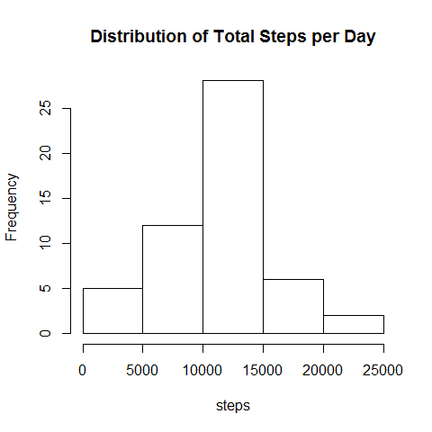
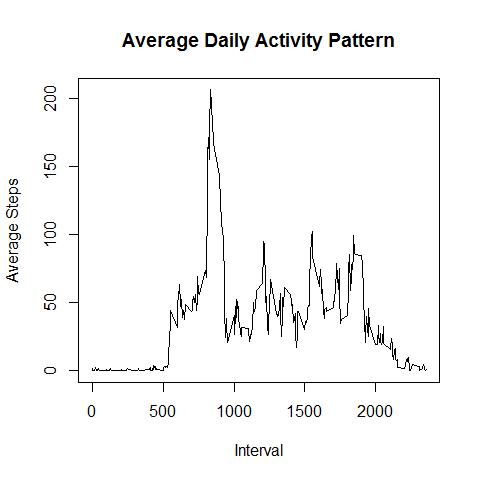
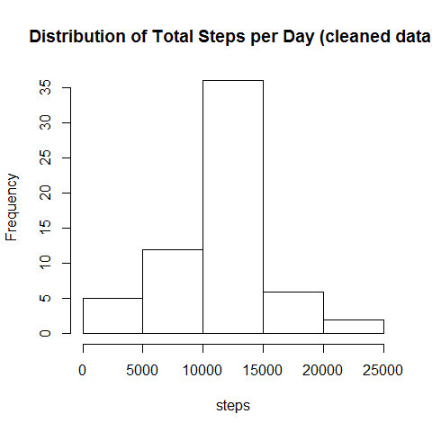

# Reproducible Research: Peer Assessment 1
Thorsten Gomann  
January, 10th 2016  

## Loading and preprocessing the data
First I load the given data.
Instead of unpacking the zip-file to a separate file I unzip and read in one step:


```r
df <- read.csv(unz("activity.zip", "activity.csv"))
```

There's no need for preprocessing the data at this step.

## What is mean total number of steps taken per day?
The following histogram shows the number of days grouped by respective number of steps taken per day.


```r
sumStepsDay <- tapply(df$steps, df$date, sum)
hist(sumStepsDay, xlab="steps", main="Distribution of Total Steps per Day")
```

 

Remains to calculate the mean and median:


```r
mean(sumStepsDay, na.rm=T)
```

```
## [1] 10766.19
```

```r
median(sumStepsDay, na.rm=T)
```

```
## [1] 10765
```

So the mean number of steps per day is 10766.19 and the median is 10765.

## What is the average daily activity pattern?
To display the average steps per interval I first use the tapply function to aggregate data, throwing the result to a baseplot:

```r
meanStepsInterval <- tapply(df$steps, df$interval, mean, na.rm=T)
plot(names(meanStepsInterval), meanStepsInterval, type="l", xlab="Interval", 
     ylab="Average Steps", main="Average Daily Activity Pattern")
```

 

## Imputing missing values
Which values are missing?

```r
summary(df)
```

```
##      steps                date          interval     
##  Min.   :  0.00   2012-10-01:  288   Min.   :   0.0  
##  1st Qu.:  0.00   2012-10-02:  288   1st Qu.: 588.8  
##  Median :  0.00   2012-10-03:  288   Median :1177.5  
##  Mean   : 37.38   2012-10-04:  288   Mean   :1177.5  
##  3rd Qu.: 12.00   2012-10-05:  288   3rd Qu.:1766.2  
##  Max.   :806.00   2012-10-06:  288   Max.   :2355.0  
##  NA's   :2304     (Other)   :15840
```

Dates and Intervals are always provided. Missing values are only in steps and always in a full day (date).
So the next step is to calculate the mean for each time interval (omitting NA's) and merge the data with origin data:

```r
dfMeanSteps <- aggregate(x=df$steps, by=list(df$interval), mean, na.rm=T)
names(dfMeanSteps) <- c("interval", "cleanedSteps")
dfCleaned <- merge(df, dfMeanSteps)
```

Then I replace the NA's by the <i>cleaned</i> data:

```r
dfCleaned$steps[is.na(dfCleaned$steps)] <- dfCleaned$cleanedSteps[is.na(dfCleaned$steps)]
```

Creating the same histogram as above with cleaned data:

```r
sumCleanedStepsDay <- tapply(dfCleaned$steps, dfCleaned$date, sum)
hist(sumCleanedStepsDay, xlab="steps", main="Distribution of Total Steps per Day (cleaned data)")
```

 

Also creating the mean and median:

```r
mean(sumCleanedStepsDay)
```

```
## [1] 10766.19
```

```r
median(sumCleanedStepsDay)
```

```
## [1] 10766.19
```
So the mean number of steps per day is 10766.19 and the median is 10766.19.

## Are there differences in activity patterns between weekdays and weekends?
To distinguish between weeend and weekday I use the lubridate-package. Considering 1 as Sunday and 7 as Saturday this creates the allocation to the kind of day.

```r
library("lubridate")
dfWeekday <- df
dfWeekday$weekend <- ifelse(wday(ymd(df$date)) %in% c(1,7), "weekend", "weekday")
```
By using dplyr-package for aggregating and lattice for plotting I create an aggregated dataset:

```r
library("lattice")
library("dplyr")
agg <- dfWeekday %>%
        select(weekend, interval, steps) %>%
        filter(!is.na(steps)) %>%
        group_by(weekend, interval) %>%
        summarize(steps=mean(steps))
xyplot(steps ~ interval | weekend, agg, type="l", layout=c(1,2), ylab="Number of steps", xlab="Interval")
```

 

So the difference in activity pattern is, that weekdays starts earlier and weekends seem to be with higher activity over the day.
